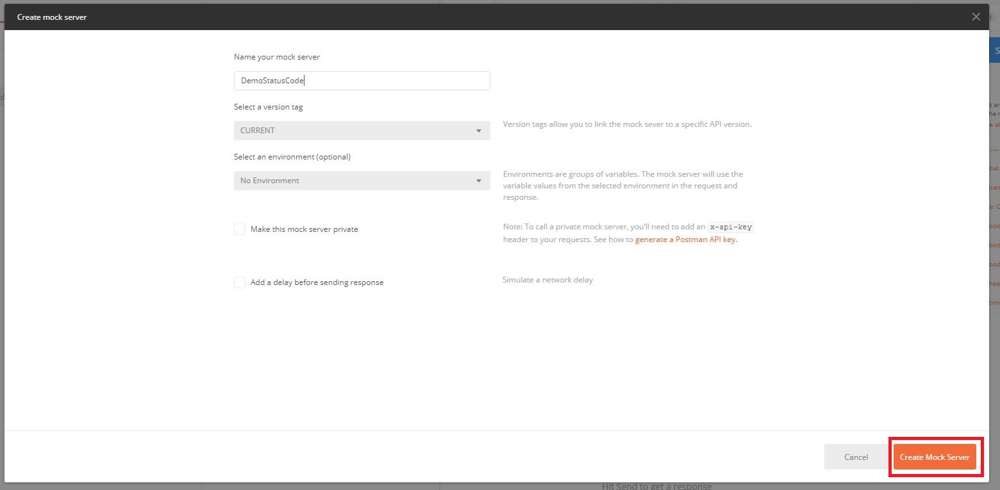

# PostmanStatusCode
A collection and environment to reproduce this question on stackoverflow : https://stackoverflow.com/questions/64723833/does-postman-mock-server-can-return-status-code-449

You may need to create your own mock server to customize the examples inside the collection.

## Reproduce the problem from scratch :

### Create a new collection

### Fill the form

### Add request

### Fill request form

### Request created

### Set the url

### Write the test script

### Add the example

### Insert status 449 in the statuc code field

### Save tabs

### Create a mock server

### Give the mock server a name

### Copy url

### Edit collection

### Create a collection variable 

### Send the request

### Observe status code 200

